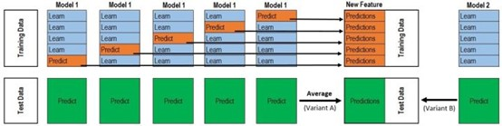

# 结果
最终准确率95.1+。

最终的准确率最高的模型，使用了`Roberta-chinese-pair-large`作为预训练模型，医学类和其他类分开训练，选用了较优的超参数，使用stacking方法融合了3个模型的15个预测结果。

# 模型思路与关键代码
## 数据处理
	把query1和query2串接起来，成为[CLS]query1[SEP]query2[SEP]的形式。tokenize，得到input_ids, input_mask, segment_ids, label

例如：
```
query1：剧 烈 运 动 后 咯 血 , 是 怎 么 了 .
query2: 剧 烈 运 动 后 咯 血 是 什 么 原 因 ？
tokens: [CLS] 剧 烈 运 动 后 咯 血 , 是 怎 么 了 . [SEP] 剧 烈 运 动 后 咯 血 是 什 么 原 因 ？ [SEP] 0 0 0 0 0 0 0 0 0 0 0 0 0 0 0 0 0 0 0 0 0 0 0 0 0 0 0 0 0 0 0 0 0 0 0 0 0 0 0 0 0 0 0 0 0 0 0 0 0 0 0 0 0 0 0 0 0 0 0 0 0 0 0 0 0 0 0 0 0 0 0 0 0 0 0 0 0 0 0 0 0 0 0 0 0 0 0 0 0 0 0 0 0 0 0 0 0 0 0 0 0 0 0 0 0 0 0 0 0 0 0 0 0 0 0 0 0 0 0 0 0 0 0 0 0 0 0 0 0 0 0 0 0 0 0 0 0 0 0 0 0 0 0 0 0 0 0 0 0 0 0 0 0 0 0 0 0 0 0 0 0 0 0 0 0 0 0 0 0 0 0
input_ids: 101 1031 3516 5507 1047 1208 1296 5067 119 2741 2209 620 647 121 102 1031 3516 5507 1047 1208 1296 5067 2741 680 620 1145 1489 6313 102 0 0 0 0 0 0 0 0 0 0 0 0 0 0 0 0 0 0 0 0 0 0 0 0 0 0 0 0 0 0 0 0 0 0 0 0 0 0 0 0 0 0 0 0 0 0 0 0 0 0 0 0 0 0 0 0 0 0 0 0 0 0 0 0 0 0 0 0 0 0 0 0 0 0 0 0 0 0 0 0 0 0 0 0 0 0 0 0 0 0 0 0 0 0 0 0 0 0 0 0 0 0 0 0 0 0 0 0 0 0 0 0 0 0 0 0 0 0 0 0 0 0 0 0 0 0 0 0 0 0 0 0 0 0 0 0 0 0 0 0 0 0 0 0 0 0 0 0 0 0 0 0 0 0 0 0 0 0 0 0 0 0 0 0 0 0 0 0 0 0 0
attention_mask: 1 1 1 1 1 1 1 1 1 1 1 1 1 1 1 1 1 1 1 1 1 1 1 1 1 1 1 1 1 0 0 0 0 0 0 0 0 0 0 0 0 0 0 0 0 0 0 0 0 0 0 0 0 0 0 0 0 0 0 0 0 0 0 0 0 0 0 0 0 0 0 0 0 0 0 0 0 0 0 0 0 0 0 0 0 0 0 0 0 0 0 0 0 0 0 0 0 0 0 0 0 0 0 0 0 0 0 0 0 0 0 0 0 0 0 0 0 0 0 0 0 0 0 0 0 0 0 0 0 0 0 0 0 0 0 0 0 0 0 0 0 0 0 0 0 0 0 0 0 0 0 0 0 0 0 0 0 0 0 0 0 0 0 0 0 0 0 0 0 0 0 0 0 0 0 0 0 0 0 0 0 0 0 0 0 0 0 0 0 0 0 0 0 0 0 0 0 0 0 0
token_type_ids: 0 0 0 0 0 0 0 0 0 0 0 0 0 0 0 1 1 1 1 1 1 1 1 1 1 1 1 1 1 0 0 0 0 0 0 0 0 0 0 0 0 0 0 0 0 0 0 0 0 0 0 0 0 0 0 0 0 0 0 0 0 0 0 0 0 0 0 0 0 0 0 0 0 0 0 0 0 0 0 0 0 0 0 0 0 0 0 0 0 0 0 0 0 0 0 0 0 0 0 0 0 0 0 0 0 0 0 0 0 0 0 0 0 0 0 0 0 0 0 0 0 0 0 0 0 0 0 0 0 0 0 0 0 0 0 0 0 0 0 0 0 0 0 0 0 0 0 0 0 0 0 0 0 0 0 0 0 0 0 0 0 0 0 0 0 0 0 0 0 0 0 0 0 0 0 0 0 0 0 0 0 0 0 0 0 0 0 0 0 0 0 0 0 0 0 0 0 0 0 0
label: 1 
```

## 训练
将input_ids 、token_type_ids、attention_masks传入模型： 
`model(input_ids=input_ids,token_type_ids=token_type_ids,attention_mask=attention_masks)`  
模型输出为outputs，loss是其第一个维度的值：  
`loss = ouputs[0]`  
向loss减小的方向更新参数：  
`loss.backward()`  
模型输出为outputs，其取`[CLS]`对应的输出作为`logits`，我们是二分类问题，logits是`[[0.18,1,65],[-0.32,0.10],...]`这样的形式，两个中较大的值对应的标签即为模型分类结果：  
`outputs = model(**inputs)`  
`_, logits = outputs[:2]`  

## 评估
将model作用于验证集，得到验证集中每一条数据的分类结果，于是可以与真实值比较，计算出各个评估指标。
 
## 预测
同评估，作用对象是测试集。

## Pretrain Model
使用`Roberta-chinese-pair-large`。Bert Model选用`Bertforsequenceclassification`。
## Tricks

按照对模型准确率的影响从大到小排序：
- 串接
- pretrain model的选择
- tokenize的方式
- 超参数设定
- 医学类和其他类数据分开训练
- 医学类数据增强
- stacking 投票
## 超参数设定
超参数设定如下，按重要性排序：
MAX_LEN = 200
LEARNING_RATE = 2e-6/5e-6
NUM_EPOCH = 2
BATCH_SIZE = 16
ADAM_EPS = 1e-8
WARMUP_PROPORTION = 0.25
WEIGHT_DECAY = 0.01
## 投票
投票和stacking都是模型融合的方法，即融合不同模型的预测结果作为最终的预测。投票是模型融合中最自然的思路，即少数服从多数。将其他类训练数据集拆分为10折交叉验证数据集，每一折数据分别进模型，10折交叉验证设置不同的随机数（set.seed），超参数不要求完全相同（感觉影响应该不大），全部完成后得到10份预测的test数据，对于每一条待预测数据，0和1的数目谁多选谁，一样多时以0.5的概率随机选择其中任何一个，后面的过程使用excel即可完成。
## Stacking
由于Stacking方法要求所融合的模型中不能有效果太差的，即要求所有模型效果都差不多的好，但每个模型之间要不同。由于没有发现效果和Roberta-pair-large差不多好的模型，所以我就只用了Roberta-pair-large模型进行stacking，融合以下三个模型：Roberta-pair-large（参数1）、Roberta-pair-large（参数2）、Roberta-pair-large（参数3），参数1、2、3只有set.seed、learning rate、最长句长不同，num_epoch都设定为1（一方面是为了最大程度保留三个模型的不同，另一方面原因是时间和GPU资源受限）。

Stacking操作的流程可以参考下图：


首先，准备进机器学习分类器的训练集数据：  

把train_others均匀分成5份，每次用其他四份做训练数据，预测第五份的标签，总共做5次；这样一轮交叉验证完成后，可以得到这五份每一份的预测标签，把这五份合并起来，就可以得到整个训练集的预测标签，这就是模型1对train_others的预测结果。同样这样操作，得到模型2、3对train_others的预测结果。模型1、2、3对train_others的预测结果就是要进入模型训练的三个特征，标签是train_others的真实标签。

然后，准备进机器学习分类器的测试集数据：  

在上面的过程中，在每一个模型的5折交叉验证训练中，每次也输出对test_others的预测标签，于是一个模型可以得到5份test_others的预测标签，多数投票后就是这个模型对test_others的预测结果。同样这样操作，可以得到模型2、3对test_others的预测结果。模型1、2、3对test_others的预测结果分别和训练集中模型1、2、3对train_others的预测结果对应，作为测试集的三个特征，分类器训练好后，输入测试集的3个特征，即可得到对测试集数据的预测，这就是stacking方法对test_others最终的预测结果。

最后，使用机器学习的分类器进行分类。（此处用的是随机森林分类器）

Stacking的参考网站：  
https://zhuanlan.zhihu.com/p/26890738  
https://www.jianshu.com/p/719fc024c0ec

